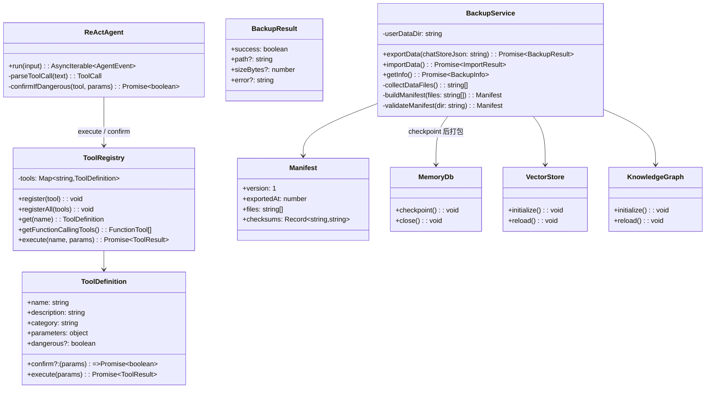
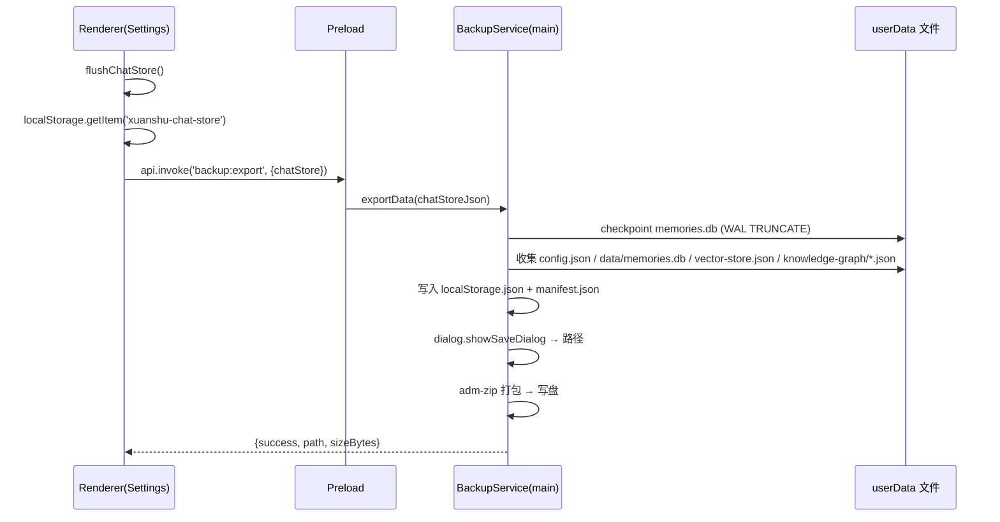
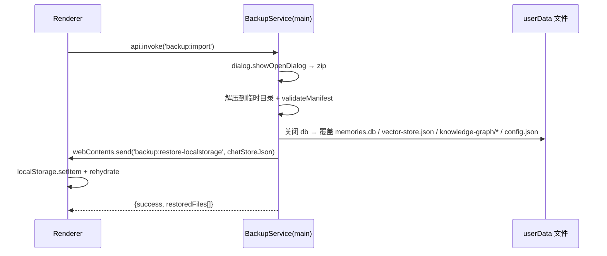
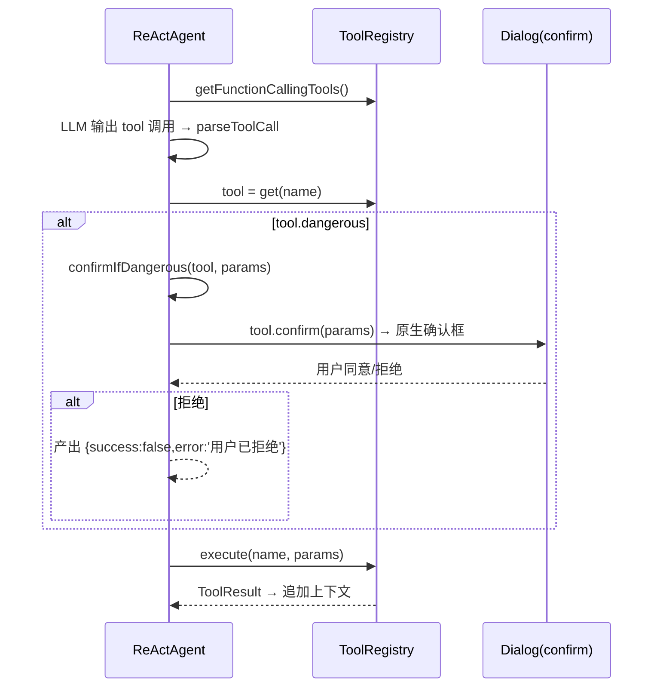
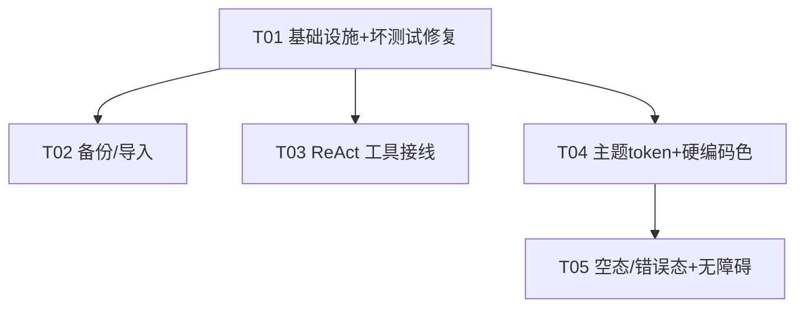

# 玄枢AI 第二轮打磨专项 · 系统设计与任务分解

> 架构师 Bob · 交付物：功能完善（备份/导入、ReAct 工具接线、坏测试修复）+ UI 精致优化（主题 token、硬编码颜色、空态/错误态、无障碍）
> 所有结论均已读源码核实，非仅依据审计清单。

---

## 0. 关键核实结论（与审计清单的差异）

| 项目 | 审计说法 | 核实结果 |
|---|---|---|
| chatStore 持久化 key | — | `xuanshu-chat-store`（`chatStore.ts:265`，zustand persist + `createJSONStorage`，1000ms 去抖 + beforeunload flush）。**全 renderer 仅此一个 persist store** |
| 记忆存储 | `userData/data/memories.db` | 确认（`memory.ipc.ts:24-28`），**WAL 模式**，存在 `memories.db-wal/-shm` 伴生文件 |
| 向量库 | `userData/vector-store.json` | 确认（`vector-store.ts:131`），`_version:1` |
| 知识图谱 | `userData/knowledge-graph/*.json` | 确认 `entities.json` + `relations.json`（`knowledge-graph/index.ts:50,67,78`），原子 tmp+rename 写入 |
| 配置 | 未提 | **补充**：electron-store 写 `userData/config.json`（`config.ipc.ts:137`，`diagnostics.ipc.ts:36` 佐证），需一并纳入备份 |
| ReAct 工具 | `registerAllTools` 空 stub | 确认（`tool-registry.ts:131-133`），但已在 `modules.register.ts:67` 被调用并传 deps |
| split-text 坏测试 | 引用 `embedder.ts` | 测试 import 的是 `src/main/rag/embedding`；`embedding.ts:2` 顶层 import `nomicEmbedder`，`embedder.ts:46,66` **模块加载即执行** `app.getAppPath()` 与 `ensureModelsDir()`（写磁盘）。electron mock 缺 `getAppPath`/`isPackaged` |
| resilience 坏测试 | 引用不存在的模块 | **确认不存在**：`src/main/utils/` 下无 `resilience.ts`，全 `src` 无 `CircuitBreaker/withRetry/Bulkhead` |
| 主题双套 | COLORS vs CSS var | COLORS 被 **1161 处**引用，横跨 30 个 renderer 文件 + 1 个主进程文件 `emotion-engine.ts`（主进程无 DOM，不能吃 `var()`） |

---

# Part A · 系统设计

## 1. 实现方案

### 1.1 数据备份/导出/导入（核心）

**localStorage 读取方案判断**：localStorage 是 renderer 专属 Web API，Electron 持久化在 `userData/Local Storage/leveldb`（Chromium 内部格式，跨版本不稳定且有锁）。**结论：采用「renderer 读取 → 经 IPC 传给主进程」**，不直读 LevelDB。chatStore 的去抖存储需先 `flush()` 落盘再读。

**方案要点**：
- 新增主进程模块 `src/main/backup/index.ts`（复用 `adm-zip`，参考 `diagnostics.ipc.ts` 现成模式）。
- 导出时 renderer 先 `flushChatStore()` → 读 `localStorage.getItem('xuanshu-chat-store')` → `api.invoke('backup:export', { chatStore })`；主进程收集 userData 文件 + 写入 `localStorage.json` + 生成 `manifest.json` → `dialog.showSaveDialog` 选路径 → 打包 zip。
- 导入反向：`backup:import` → `dialog.showOpenDialog` → 解压到临时目录 → 校验 manifest → 逐项恢复 → 通知 renderer 重载 localStorage。

**SQLite 一致性关键点**：打包前对 memories.db 执行 `PRAGMA wal_checkpoint(TRUNCATE)`（新增 `checkpointMemoryDb()` 导出，或在 backup 内直接 `db.pragma`），使 `.db` 自包含，zip 内**只含 `.db`，不含 wal/shm**，避免备份到不一致的中间态。

### 1.2 ReAct 工具接线

**核实到的两个关键点**：
1. `search/index.ts:143` 已存在 `internetSearch.getTools(): FunctionTool[]` —— 现成的 function-calling schema 来源，`registerAllTools` 应优先复用。
2. `modules.register.ts:67` 传 deps `{ dynamicOperationEngine, knowledgeGraph, vectorStore, voiceEngine, internetSearch: externalAIClient }` —— **命名有 bug**：`externalAIClient` 是图像生成客户端，真正的联网搜索单例是 `search/index.ts` 的 `internetSearch`。接线时需修正引用。

**能力 → 工具映射**（详见 §3 类图/§7 任务）：搜索类（`internetSearch.search/searchWithRAG/fetchUrl/getWeather/getNews/getExchangeRate/getCurrentTime`）、知识类（`knowledgeGraph.query/searchEntities/queryCommonRules`）、记忆类（`vectorStore.search/searchByType`）、视觉/桌面类（`visualAgent.executeTask` + desktop-automation 需重构导出可调用函数）、任务类（`dynamicOperationEngine.analyzeAndPlan/executeTask`）、语音类（`voiceEngine`）。

**危险工具确认门**：`ToolDefinition` 增加 `dangerous?: boolean` 与可选 `confirm?(params) => Promise<boolean>`；`ReActAgent.run` 在 `execute` 前对 dangerous 工具调用 `confirm()`（复用 desktop-automation 已有的 `confirmRisk`、visual-agent 的 `confirmSingleAction` 原生确认框），拒绝则产出 `{success:false, error:'用户已拒绝'}` 并继续循环。

### 1.3 坏测试修复

- `split-text`：**根因**是 `embedder.ts` 顶层副作用（`app.getAppPath()` + `ensureModelsDir()` 写盘），splitText 本身不需要 embedder。**修复**：① 根因修复——把 `RESOURCES_DIR`/`ensureModelsDir()` 收敛到懒加载/`initialize()`；② 防御修复——`vitest.setup.ts` 的 electron mock 补 `getAppPath`/`isPackaged`。
- `resilience`：模块确不存在。**修复**：新建 `src/main/utils/resilience.ts`（纯 TS、无依赖，实现 `CircuitBreaker/withRetry/withTimeout/Bulkhead`，满足测试契约）；若团队判定 resilience 不在范围内，则删测试（备选）。

### 1.4 UI 优化方向（影响面最小）

**主题 token 统一方向**：以 `globals.css` 的 CSS 变量为**唯一真源**。把 `theme.ts` 的 `COLORS` 值从 hex 改为 `var(--token)` 别名（一处改动，1161 处 renderer 用法自动随主题切换，零组件改动）；同时**另存一份 hex 导出**（如 `HEX_COLORS`）供主进程 `emotion-engine.ts` 使用。补齐缺失变量（`--violet`），修正漂移值（`cardBg`→`--bg-elevated`、`cardBorder`→`--border-card`、`cardBorderHover`→`--border-strong`）。

---

## 2. 文件清单（新增 / 修改）

```
src/main/backup/index.ts                 # 新增：备份服务（导出/导入/校验/manifest）
src/main/utils/resilience.ts             # 新增：CircuitBreaker/withRetry/withTimeout/Bulkhead
src/main/agent/tool-registry.ts          # 修改：registerAllTools 实装
src/main/agent/types.ts                  # 修改：ToolDefinition + dangerous/confirm
src/main/agent/react-loop.ts             # 修改：dangerous 确认门
src/main/context-manager/embedder.ts     # 修改：去顶层副作用（懒初始化）
src/main/desktop-automation/index.ts     # 修改：抽出可调用函数（供工具注册）
src/main/register/ipc.register.ts        # 修改：注册 backup:* handler
src/main/register/modules.register.ts    # 修改：修正 registerAllTools deps
src/preload/index.ts                     # 修改：IpcChannels 增 backup:* + api 暴露
src/renderer/store/chatStore.ts          # 修改：导出 flushChatStore()
src/renderer/shared/theme.ts             # 修改：COLORS→var() 别名 + HEX_COLORS 导出
src/renderer/styles/globals.css          # 修改：补齐 --violet 等缺失 token
src/main/persona/emotion-engine.ts       # 修改：改用 HEX_COLORS
src/renderer/components/EmptyState.tsx   # 修改：硬编码颜色→var()
src/renderer/components/ErrorDisplay.tsx # 修改：硬编码颜色→var()
src/renderer/components/LoadingSkeleton.tsx # 修改：硬编码颜色→var()
src/renderer/components/a11y.tsx         # 修改：SkipLink 颜色→var()
src/renderer/components/layout/Sidebar.tsx # 修改：删内联 SkipLink（去重）
src/renderer/main.tsx                    # 修改：错误覆盖层颜色→var()
src/renderer/App.tsx                     # 修改：诊断面板硬编码颜色→var()
src/renderer/pages/Home/ChatPanel.tsx    # 修改：aria-label 补全
src/renderer/components/WebSearchPanel.tsx # 修改：开关 aria-label
src/renderer/components/TaskProgressOverlay.tsx # 修改：折叠/取消按钮 aria-label
src/renderer/pages/Home/HomeHeader.tsx   # 修改：空态改用 EmptyState（接 i18n）
src/renderer/pages/Settings/SettingsGeneral.tsx # 修改：备份/导入入口 UI
tests/core/split-text.test.ts            # 修改：适配（视修复方式）
tests/services/resilience.test.ts        # 修改：适配（视修复方式）
vitest.setup.ts                          # 修改：electron mock 补 getAppPath/isPackaged
```

## 3. 数据结构与接口（classDiagram）



## 4. 程序调用流（sequenceDiagram）

### 4.1 备份导出



### 4.2 备份导入



### 4.3 ReAct 危险工具确认



## 5. Anything UNCLEAR（假设）

1. **resilience 取舍**：默认实现模块（方案 A），若团队判定无消费者则改为删测试（方案 B），需 QA 拍板。
2. **空态统一范围**：默认「HomeHeader 改用 EmptyState 组件」；若本轮时间紧，退化为「删死代码、保留 HomeHeader」，二选一。
3. **危险工具确认粒度**：个人自用默认**首次确认 + 会话内记住**（或逐次确认）；具体交互（原生 dialog vs 应用内确认卡）由前端确认，本设计只定「confirm 回调」接口。
4. **备份是否含模型/插件目录**：默认**不含**大体积模型与插件二进制，只备用户数据；如需全量可加 `--full` 选项。
5. `violet`(#8b5cf6) 与 `--theme-purple`(#6b7280) 值不一致，按「COLORS.violet 语义」新增 `--violet: #8b5cf6`。

---

# Part B · 任务分解

## 6. 所需依赖

无需新增第三方包；`adm-zip@^0.5.17` 与 `@types/adm-zip` 已在依赖中。resilience 为纯 TS 自实现。

```
- adm-zip@^0.5.17          # 已存在：备份 zip 打包
- @types/adm-zip@^0.5.8    # 已存在
- better-sqlite3@^12.11.1  # 已存在：备份时 checkpoint
```

## 7. 任务列表（按依赖排序，共 5 项）

### T01 · 基础设施：坏测试修复 + 依赖地基（P0）
- **Source Files**：`vitest.setup.ts`、`src/main/context-manager/embedder.ts`、`src/main/utils/resilience.ts`、`tests/core/split-text.test.ts`、`tests/services/resilience.test.ts`
- **Dependencies**：无
- **内容**：① electron mock 补 `getAppPath: vi.fn(()=>'/mock/app')`、`isPackaged:false`；② `embedder.ts` 去顶层副作用（`RESOURCES_DIR` 改函数内惰性求值，`ensureModelsDir()` 移入 `initialize()`）；③ 新建 `resilience.ts`（CircuitBreaker/withRetry/withTimeout/Bulkhead，满足测试契约：`OPEN`/`Timeout`/`Queue full` 消息）；④ 跑通 `vitest run`。

### T02 · 数据备份/导出/导入（P0）
- **Source Files**：`src/main/backup/index.ts`、`src/main/register/ipc.register.ts`、`src/preload/index.ts`、`src/renderer/store/chatStore.ts`、`src/renderer/pages/Settings/SettingsGeneral.tsx`
- **Dependencies**：T01
- **内容**：实现 `backup:export` / `backup:import` / `backup:get-info`；chatStore 导出 `flushChatStore()`；Settings 加「导出备份 / 导入备份」按钮；内存 db 增加 checkpoint 能力；manifest + 校验 + 恢复后重载。

### T03 · ReAct 工具接线（P0）
- **Source Files**：`src/main/agent/tool-registry.ts`、`src/main/agent/types.ts`、`src/main/agent/react-loop.ts`、`src/main/desktop-automation/index.ts`、`src/main/register/modules.register.ts`
- **Dependencies**：T01
- **内容**：实装 `registerAllTools`（复用 `internetSearch.getTools()` schema + 手写视觉/知识/记忆/桌面/任务工具）；`ToolDefinition` 增 `dangerous/confirm`；`react-loop.ts` 增确认门；`desktop-automation` 抽出可调用函数；修正 deps 里 `internetSearch` 引用。

### T04 · 主题 token 统一 + 硬编码颜色替换（P1）
- **Source Files**：`src/renderer/shared/theme.ts`、`src/renderer/styles/globals.css`、`src/main/persona/emotion-engine.ts`、`src/renderer/components/{EmptyState,ErrorDisplay,LoadingSkeleton,a11y}.tsx`、`src/renderer/{main.tsx,App.tsx}`
- **Dependencies**：T01
- **内容**：COLORS→`var()` 别名 + `HEX_COLORS` 导出；globals.css 补 `--violet` 等；emotion-engine 改 HEX；逐处替换硬编码色（清单见 §8）。

### T05 · 空态/错误态统一 + 无障碍（P1/P2）
- **Source Files**：`src/renderer/pages/Home/HomeHeader.tsx`、`src/renderer/pages/Home/ChatPanel.tsx`、`src/renderer/components/WebSearchPanel.tsx`、`src/renderer/components/TaskProgressOverlay.tsx`、`src/renderer/components/layout/Sidebar.tsx`
- **Dependencies**：T04
- **内容**：HomeHeader 空态改用 `EmptyState` + 接 i18n `chat.emptyState`；aria-label 补全（复制/播报/发送/历史面板 X/勾/搜索开关/折叠/取消）；`FocusTrap` 接入模态/滑出面板；双 SkipLink 去重（保留 a11y.tsx 的 `<SkipLink>`，删 Sidebar 内联版）。

## 8. Shared Knowledge（跨任务约定）

- 所有 IPC 返回值统一 `{ success, data?, error? }`；`backup:*` 走 `api.invoke`（preload 30s 超时，大备份可能需 `invokeWithTimeout` 放宽）。
- SQLite 备份前必须 `wal_checkpoint(TRUNCATE)`；zip 只含 `.db`，不含 `-wal/-shm`。
- 导入为**破坏性操作**：先整体备份现有数据到 `userData/backup-pre-import-*.zip` 再覆盖。
- 主题：渲染层只用 `var(--*)` 或 COLORS 别名；主进程 `emotion-engine` 用 `HEX_COLORS`；禁止新增裸 hex。
- 危险工具 `execute` 前必经 `confirm()`；拒绝不得抛出未捕获异常，只产出失败 ToolResult。

## 9. 任务依赖图


