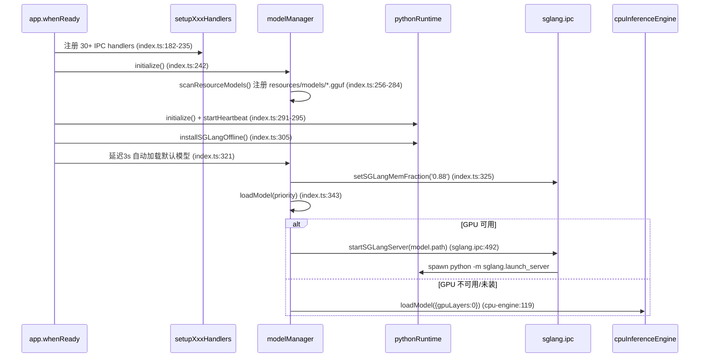
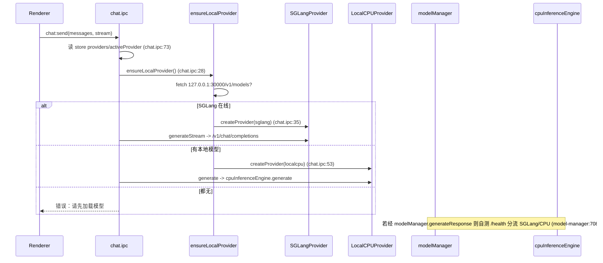
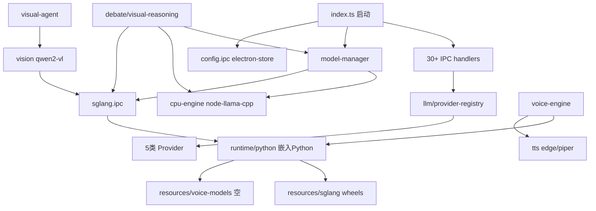

# 玄枢AI（v10.1.1）架构与运行逻辑 / 模型选型分析报告

> 分析对象：本地桌面项目 `E:\开发`（Electron 32 + React 18 + TypeScript + Zustand + Tailwind v4 + node-llama-cpp + SGLang + better-sqlite3 + electron-store）
> 方法：实地读取源码 + 核查 `resources/` extraResources 真实文件。所有结论均附 `文件:行号` 证据。

---

## 一、整体运行逻辑概述

### 1.1 主进程启动流程（`src/main/index.ts`）

1. 入口删除 `ELECTRON_RUN_AS_NODE` 防止子进程被污染（index.ts:1-3）。
2. `app.whenReady()`（index.ts:173）按固定顺序注册 **30+ 个 IPC handler**（index.ts:182-235）：window/chat/config/llm/voice/search/model/plugin/memory/knowledge/sync/rag/sglang/vision/system-control/permission/operation/voice-wake/external-ai/internet-search/model-manager/system-monitor/dynamic-operation/device/inference/voice-engine/task-planner/task-scheduler/personalization/knowledge-graph/mobile-channel/ollama/vision-queue/python/floating-ball/fulltext-search/voice-clone/visual-agent/workflow/automation。
3. **Step3 模块初始化**（index.ts:242-254）逐个 `try/catch` 初始化：modelManager / knowledgeGraph / voiceWake / mobileChannel / voiceEngine / vectorStore / dynamicOperation / personalization / taskPlanner / taskScheduler / externalAI / visionModel。
4. **惰性模型注册**（index.ts:256-284）：扫描两个位置——`userData/models`（用户下载）与 `resources/models`（预置）。硬编码注册 3 个：`deepseek-r1-7b`(main)、`qwen2-vl-7b`(vision)、`nomic-embed`(embedding)。`preBundledModels` 为空数组（:270）。
5. **后台异步**（index.ts:289-318）：`pythonRuntime.initialize()` → `pythonRuntime.startHeartbeat(15000)` → `pythonRuntime.installSGLangOffline()` → `deviceOptimizer.startMonitoring`。
6. **自动加载默认模型**（index.ts:321-357）：延迟 3s，`setSGLangMemFraction('0.88')`（:325），按 `priorityOrder = ['deepseek-r1-7b','qwen2.5-7b','minicpm-2b']`（:341）选模型后 `modelManager.loadModel()`。
7. **退出清理**（index.ts:378-418 `before-quit`）：停心跳、停监控、卸载模型、停各引擎、优雅停 SGLang（8s 超时）。

### 1.2 模型加载 / 卸载 / 空闲回收（`src/main/model-manager/index.ts`）

- **加载** `loadModel(modelId)`（:219-292）：GPU 优先——`isGpuAvailable()`（cpu-engine:58，阈值 ≥4000MB VRAM）→ 检测 `import sglang`（`python -c`）→ 未装则 `ensureSGLang()`（弹窗装）→ `startSGLangServer(model.path)`（spawn `python -m sglang.launch_server --mem-fraction-static`）→ 否则 **CPU 回退** `tryCpuLoad()` → `cpuInferenceEngine.loadModel({gpuLayers:0})`（cpu-engine:133）。
- **卸载** `unloadModel()`（:297-337）：仅 `stopSGLang()`，**从不调用 `cpuInferenceEngine.unload()`**。
- **空闲回收**：`IDLE_TIMEOUT_MS = 15min`（:70），定时器 `cleanupUnusedModels`（:132）与 `resetIdleTimer`（:153）在推理中（`isGenerating`）跳过。
- **视觉切换**：`swapToVision()`（:826-859）按 `m.id.includes('vl')` 找视觉模型；`swapToMain()`（:865-890）硬编码加载 `deepseek-r1-7b`（:881）。
- **自动扫描注册** `scanResourceModels()`（:906-928）：扫描 `resources/models/*.gguf` 全部注册（含不应出现的 `mmproj-*` 投影文件，见问题 P-02）。

### 1.3 推理请求流转（`src/main/ipc/chat.ipc.ts`）

`chat:send`（chat.ipc:67）→ 读 electron-store `providers`/`activeProvider`（:73-74）→ 若 activeProvider 是外部（openai/anthropic/ollama）走对应 Provider（:77-79）；否则 `ensureLocalProvider()`（chat.ipc:28-64）：先 `fetch http://127.0.0.1:30000/v1/models` 探测 SGLang，在线则建 `SGLangProvider`；否则若 `modelManager.getLoadedModel()` 有模型则建 `LocalCPUProvider`；都无则报错要求先加载模型。流式走 `provider.generateStream` → 分块 `chat:stream` 回传（chat.ipc:91-122）。

### 1.4 各核心子系统职责与依赖

| 子系统 | 职责 | 关键依赖 |
|---|---|---|
| model-manager | 模型注册/加载/卸载/显存调度 | cpu-engine、sglang.ipc、pythonRuntime |
| cpu-engine | node-llama-cpp 进程内推理（CPU, gpuLayers:0） | node-llama-cpp |
| sglang.ipc + runtime/python | SGLang GPU 服务拉起 / Python 子进程 | 嵌入 Python、resources/sglang wheels |
| llm/provider-registry | 5 类 Provider 工厂（sglang/openai/ollama/anthropic/localcpu） | provider.ts |
| inference/debate-engine | 双模型辩论（受单模型显存约束） | model-manager、cpu-engine |
| inference/visual-reasoning | 视觉操控决策（文本） | SGLang /v1/chat/completions、cpu-engine |
| vision + visual-agent | 截图/元素识别/操控执行 | vision-model（qwen2-vl via SGLang） |
| voice-engine + tts | 音色克隆提取 / TTS 合成 | pythonRuntime（OpenVoice 未真正接入）、Edge/Piper |
| rag/vector-store | 文本向量化（nomic-embed） | better-sqlite3 |

### 1.5 Mermaid 图

**图 1：启动与模型自动加载时序**

**图 2：一次对话推理请求流转**

**图 3：核心模块依赖架构**

---

## 二、模型选型专项评估（重点）

> 实际 `resources/models/` 含 6 个 GGUF：`deepseek-r1-7b.gguf`(4.68GB)、`qwen2-vl-7b.gguf`(4.68GB)、`nomic-embed.gguf`(146MB)、`Qwen2.5-7B-Instruct.gguf`(5.44GB)、`mmproj-F16.gguf`(1.35GB)、`mmproj-Qwen2.5-VL-7B-Instruct-F16.gguf`(1.35GB)。

### 2.1 主对话模型 — `deepseek-r1-7b` + `Qwen2.5-7B-Instruct`　【基本合理】
- **证据**：index.ts:264-266 硬编码注册 `deepseek-r1-7b`；`resources/models` 实测存在 `deepseek-r1-7b.gguf`、`Qwen2.5-7B-Instruct.gguf`。
- **合理性**：7B 级别在 CPU（node-llama-cpp）与 GPU（SGLang）双路均可跑，符合"本地 AI 助手"定位。
- **风险**：
  - **量化等级不透明**（P-05）：预置文件名**无 Qx_K 后缀**（如 `deepseek-r1-7b.gguf`），而下载目录 `model.ipc.ts:565` 的 HF URL 明确为 `Q5_K_M`（5.5GB）。实测 `deepseek-r1-7b.gguf` 仅 4.68GB，说明预置量化简与下载目录声明的 `Q5_K_M` 不一致，**无法从文件名确认量化等级**。
  - **CPU 路径绕过模型原生 chat 模板**（P-10）：cpu-engine `buildFullPrompt`（cpu-engine:294-316）用手写 `[系统设定]\n用户:...\nAI:` 格式，直接 `session.prompt(fullPrompt)`（cpu-engine:193），对 DeepSeek-R1（蒸馏 Qwen，含推理标签）指令遵循与格式会下降。
- **结论**：选型合理，但量化标注缺失、CPU 路径模板处理有损。

### 2.2 视觉操控模型 — `qwen2-vl-7b`　【合理，但被冗余/冲突拖累】
- **证据**：vision/index.ts:771 `model: 'qwen2-vl'`；element-recognizer 与 vision-queue:34 均调 `visionModel.analyze`。visual-agent 五层架构（visual-agent/index.ts:1-22）复用 `qwen2-vl-7b` 做屏幕理解（element-recognizer）+ 主 LLM 做决策（visual-reasoning.ts:301 → SGLang `/v1/chat/completions`）。
- **合理性**：Qwen2-VL-7B 适合屏幕 OCR/元素识别，满足"视觉操控"。
- **风险**：
  - **`mmproj-*.gguf` 投影文件是冗余孤儿**（P-02）：这两个 1.35GB 文件是 llama.cpp 多模态投影权重，SGLang 路径**不消费**它们（SGLang 用模型自带多模态能力）。且 `scanResourceModels` 把它们误注册为 `type:'main'` 聊天模型（model-manager:906-928, 921-924），用户可选中后加载必失败。
  - **与对话模型争用单张 6GB 显存**：model-manager 注释明确"6GB 显存，同一时间只能加载一个模型"（model-manager:16）。视觉推理要求 qwen2-vl 驻留显存，与对话模型互斥，需 `swapToVision/swapToMain` 反复切换（每次 10s+）。
- **结论**：视觉模型选型本身合理，但打包了无用的 mmproj 文件并产生注册污染。

### 2.3 嵌入/RAG 模型 — `nomic-embed`　【合理】
- **证据**：index.ts:266 注册 `nomic-embed`(embedding)；`resources/models/nomic-embed.gguf`(146MB) 存在；rag/embedding 使用。
- **合理性**：nomic-embed-text-v1.5 是标准本地嵌入模型，适配 RAG/语义检索。

### 2.4 语音克隆 OpenVoice（256 维 speaker embedding）— 【未真正集成，开箱即用不成立】
- **证据**：
  - `resources/voice-models/` 仅含 `.gitkeep` + 空 `base_speakers/` + 空 `checkpoints/.cache/`（实测仅 3 个文件，无 `G_100000.pth`/`open_voice_checkpoint`）。
  - 嵌入 Python `Lib/site-packages` **无 `openvoice` 包**（实测：torch/transformers/numpy 存在，openvoice MISSING）。
  - `openvoice-bridge.ts:149-178 checkModelsRaw` 同时要求 checkpoint 文件 **且** `import openvoice` 通过，二者皆不满足 → `modelReady=false` → 回退。
  - `autoDownloadModels`（openvoice-bridge.ts:103-144）依赖 `resources/voice-models/download_models.py`，**该脚本不存在** → 永远无法自动下载。
  - 提取侧回退到 `fallbackExtraction` 的 **MFCC/random 256 维伪向量**（openvoice-bridge.ts:260、:373-444）。
  - **合成侧根本不用 OpenVoice**：`voice:clone:test`（voice-clone.ts:149-224）仅从 256 维向量算 RMS/centroid/energy，推出 `pitch`/`rate` 微调，喂给 **Edge TTS 预设音色**（`zh-CN-XiaoxiaoNeural` 等，:196-201）。即"克隆音色"= Edge 预设 + 轻微音调/语速偏置，**并非真实音色克隆**。
  - 预置音色列表 `listPresetSpeakers`（openvoice-bridge.ts:449-492）第 491 行 `.filter(p => existsSync(p.embeddingPath) || true)` 的 `|| true` 使**即使 .npy 文件不存在也恒返回 5 个预置** → 加载得零向量（:522）。
- **结论**：产品宣称"语音克隆 OpenVoice（256维 speaker embedding）开箱即用"**未达成**；当前是"伪 256 维 + Edge TTS 音色微调"的降级实现。

### 2.5 SGLang GPU 预集成 — 【设计自洽但需实测验证】
- **证据**：sglang.ipc.ts:126-137 spawn `python -m sglang.launch_server --model-path ... --mem-fraction-static <frac>`；`resources/sglang/wheels/` 含 55 个 wheel（sglang、transformers、numpy 等），**但无 `torch`/`flashinfer`/`vllm`**；`install_sglang_offline.py` 用 `pip install --no-index --find-links wheel_dir sglang`（实测脚本:46）。嵌入 Python `Lib/site-packages` **已预装 `torch`/`transformers`/`numpy`**（实测：torch PRESENT）。
- **关键判断**：离线脚本 `--no-index` 仅从 `wheels/` 取包，但 **torch 已由嵌入 Python 预装**，pip 会把已安装的 torch 视为满足依赖，故离线 sglang 安装**大概率可行**（wheels 缺 torch 是"设计上依赖预装环境"，非缺陷）。
- **风险**：
  - 该路径**未在交付前实测**，依赖预装 torch 版本与 sglang wheel 的版本兼容；且 `sglang.ipc.ts:26` 默认 `mem-fraction=0.88`，而同文件 :125 注释写"0.80 RTX3060 6GB" —— **0.88 与 6GB 目标硬件矛盾，4.68GB 模型 + KV cache 在 0.88×6GB≈5.28GB 下极易 OOM**（P-04）。
- **结论**：SGLang GPU 方案设计自洽、离线可行性强，但显存比例参数自相矛盾，需在 6GB 真机验证。

### 2.6 CPU / GPU 双路径 — 【稳妥但质量不一致】
- **证据**：GPU 走 SGLang（`/v1/chat/completions` 的 `messages` 数组由 SGLang 服务端套用模型模板，正确）；CPU 走 node-llama-cpp `gpuLayers:0`（cpu-engine:133，纯 CPU）。
- **风险**：同一模型在两条路径下**输出质量不一致**——GPU 用原生模板，CPU 用手写格式绕过模板（P-10）。设计本身（GPU=SGLang、CPU=llama.cpp）是稳妥的，问题是 CPU 引擎的模板处理有损。

### 2.7 "声明但未真正实现" 的 provider / 模型
- **Provider 均完整实现**：`SGLangProvider/OpenAIProvider/AnthropicProvider/OllamaProvider/LocalCPUProvider` 在 `provider.ts` 中 generate/generateStream/listModels 全部实现，**无空壳**。
- **但外部 provider 默认未接线**（P-06）：`config.ipc.ts:90-91` 默认 `providers:[]`、`activeProvider:''`，故开箱即用只有本地模型路径；OpenAI/Ollama 需用户在设置里手动填（仅做 https 格式校验）。代码支持"可切换"，但非预置。
- **visual-agent"完整版"模型并不存在**（P-06）：实际复用通用 `qwen2-vl-7b`（vision/index.ts:771），没有独立打包的"visual-agent 完整版" GGUF。

### 2.8 自动加载死配置
- **证据**：index.ts:341 `priorityOrder = ['deepseek-r1-7b','qwen2.5-7b','minicpm-2b']`，但 `qwen2.5-7b` 与 `minicpm-2b` **从未被注册**（注册 id 是 `deepseek-r1-7b`/`qwen2-vl-7b`/`nomic-embed`，而 `scanResourceModels` 把 `Qwen2.5-7B-Instruct.gguf` 注册为 id `Qwen2.5-7B-Instruct`，大小写/格式都不匹配）。→ 自动加载永远回退到 `installedModels[0]`（deepseek-r1-7b）。两个 id 是死配置（P-05）。

---

## 三、架构现存问题清单

| 编号 | 严重度 | 问题 | 影响 | 证据 |
|---|---|---|---|---|
| P-01 | **P1** | **CPU 推理引擎模型泄漏**：`unloadModel` 仅 `stopSGLang()`，从不调 `cpuInferenceEngine.unload()`；`before-quit` 也只走 `modelManager.shutdown()`（→stopSGLang）；`CpuInferenceEngine.loadModel` 加载新模型前不释放旧模型 | CPU 路径切模型泄漏旧模型驻留 RAM；CPU 模式退出时 ~4.6GB 模型+context 未释放（仅靠进程 kill） | model-manager:297-337、:397；cpu-engine:119-167（无 dispose 旧模型）、:341-350（unload 存在却从不调用） |
| P-02 | **P2** | **mmproj 投影文件被误注册为可加载聊天模型**：`scanResourceModels` 扫描所有 `*.gguf` 含 `mmproj-F16.gguf`/`mmproj-Qwen2.5-VL-7B-Instruct-F16.gguf`，按 `includes('vl'/'embed')` 判类型失败 → `type:'main'` | 用户可在模型页选中这两个非权重文件并尝试加载，必失败/崩溃；`swapToVision` 的 `includes('vl')` 也可能误匹配 | model-manager:906-928、:921-924；:826-859 |
| P-03 | **P1** | **语音克隆 OpenVoice 未真正集成**：checkpoint 未打包、openvoice 包未预装、`download_models.py` 缺失；合成侧用 Edge TTS 预设 + pitch/rate 微调，非 OpenVoice ToneColorConverter | 产品宣称"256维 speaker embedding 开箱即用"不成立；克隆音色实为预设音色微调 | openvoice-bridge.ts:149-178、:103-144；voice-clone.ts:149-224；resources/voice-models 实测空 |
| P-04 | **P2** | **SGLang 显存比例参数自相矛盾**：默认 `0.88`（sglang.ipc:26、index.ts:325），但同文件注释写"0.80 RTX3060 6GB"（sglang.ipc:125），且 model-manager 注释声明"6GB 显存仅能加载一个模型" | 0.88 在 6GB 显卡上，4.68GB 模型+KV cache 极易 OOM，目标硬件 GPU 路径可能起不来 | sglang.ipc.ts:26、:125；index.ts:325；model-manager:16 |
| P-05 | **P3** | **自动加载优先级引用未注册 id + 量化不透明**：`priorityOrder` 含 `qwen2.5-7b`/`minicpm-2b`（均不存在）；预置 GGUF 文件名无 Qx_K 后缀，量化等级不可确认 | 死配置导致永远回退 deepseek-r1-7b；运维无法确认量化 | index.ts:341、:264-266；model.ipc.ts:565 |
| P-06 | **P3** | **外部 provider / 独立视觉模型"声明但未接线"**：`config.ipc` 默认 `providers:[]`；"visual-agent 完整版"实为复用 qwen2-vl | 开箱即用仅本地模型；"Ollama/OpenAI 可切换""独立视觉操控模型"在交付形态上未体现 | config.ipc.ts:90-91；vision/index.ts:771；provider-registry.ts:26-69 |
| P-07 | **P2** | **Python 心跳重启无效 + 健康检测形同虚设**：`startHeartbeat` 崩溃时调 `initialize()`，但 `initialize` 首行 `if(this.env) return`（已初始化过则永远 no-op）；`checkHealth` 仅 `python -c "print('ok')"` 验证解释器能否启动，不检测 SGLang 服务/实际可用性 | 运行时 Python/SGLang 崩溃后无法自愈，GPU 推理静默失效 | runtime/python.ts:38-60、:69-84、:113-114 |
| P-08 | **P3** | **Python 子进程执行安全风险**：`runScript`（runtime/python.ts:353-402）接受任意脚本经 `python:run` IPC 暴露；`installPackage` 可 pip 装任意包；spawn 继承 `env:{...process.env}` | 本地桌面风险中等，但缺沙箱/白名单，任意代码执行面 | runtime/python.ts:353-402、:404-428、:502 |
| P-09 | **P3** | **SSRF 校验缺口**：`llm:add-provider`（llm.ipc:46-68）仅校验 `https://` 前缀，**未调用 `isPrivateUrl`**（只有 `llm:test-provider` 调了）；用户可添加 `https://192.168.x.x` 内网地址，chat 时 fetch 该地址 | 经 https 的内网 SSRF | llm.ipc.ts:14-34、:46-68 vs :117-143 |
| P-10 | **P2** | **CPU/GPU 双路径 chat 模板不一致**：CPU 引擎 `buildFullPrompt` 手写格式绕过模型原生模板（cpu-engine:294-316），GPU 路径经 SGLang `messages` 走服务端模板 | 同一模型两条路径输出质量不一致，CPU 路径对 DeepSeek-R1/Qwen 指令遵循与推理格式下降 | cpu-engine.ts:193、:294-316；provider.ts:337-341 |
| P-11 | **P2** | **辩论引擎与"单模型显存"约束矛盾**：`debate-engine` 每轮 `swapToVRAM(modelA/modelB)` 在 6GB（一次仅一模型）下反复卸载/加载 7B（每次 10s+），且 `preloadToRAM` 把两个 4.6GB 模型同时驻留 RAM（~9.2GB） | "双模型辩论"在目标硬件上实际不可用/极慢、内存吃紧 | inference/debate-engine.ts:39-99、:73-99 |
| P-12 | **P3** | **配置持久化双写/潜在竞争**：index.ts:333-339 直接用 `fs` 读 `userData/config.json` 的 `defaultModelId`；config.ipc.ts:67-103 用 electron-store 读写**同一文件** `config.json`（有名缓存 + 原始 fs 读，无同步） | 可能读到过期配置值 | index.ts:333-339；config.ipc.ts:67-103 |
| P-13 | **P3** | **localhost vs 127.0.0.1 不一致**：`SGLangProvider` baseUrl 默认 `http://localhost:30000`（provider.ts:39），而服务绑定 `--host 127.0.0.1`（sglang.ipc:130），index/chat 用 `127.0.0.1` | 部分系统 `localhost` 解析到 `::1`(IPv6) 致连接失败 | provider.ts:39；sglang.ipc.ts:18、:130 |
| P-14 | **P3** | **SGLang 进程 `unref()`**（sglang.ipc:139）：与事件循环解绑，父进程非优雅退出（崩溃/强制 kill）时可能成孤儿进程 | GPU 显存/进程泄漏，需手动清理 | sglang.ipc.ts:139、:453-489 |

---

## 四、开箱即用（模型与依赖）达成度结论

### 4.1 模型层
| 能力 | 预置模型 | 结论 |
|---|---|---|
| 对话（主） | `deepseek-r1-7b.gguf`(4.68GB) ✓ | **达成**，但量化等级不透明（P-05） |
| 对话（备选） | `Qwen2.5-7B-Instruct.gguf`(5.44GB) 存在但未注册 | 文件在、未接线，自动加载死配置（P-05） |
| 视觉操控 | `qwen2-vl-7b.gguf`(4.68GB) ✓ | **达成**；冗余 `mmproj-*.gguf` 污染注册（P-02） |
| 嵌入/RAG | `nomic-embed.gguf`(146MB) ✓ | **达成** |
| 语音克隆(OpenVoice) | `resources/voice-models/` 为空、openvoice 包未预装 | **未达成**（P-03，降级为 Edge TTS 微调） |
| 视觉"完整版"独立模型 | 无独立 GGUF，复用 qwen2-vl | **未作为独立模型提供**（P-06） |

### 4.2 依赖层
- **嵌入 Python 3.12**：`resources/python/` 存在且预装 **torch/transformers/numpy**（实测），支撑 SGLang 离线安装——**这是 SGLang GPU 路径能开箱接近可用的关键**。
- **SGLang 离线 wheels**：55 个 wheel 含 `sglang`/`transformers`/`numpy`，**缺 `torch`**（设计上依赖预装 Python，验证可行但**未在真机实测**，且 `mem-fraction 0.88` 与 6GB 矛盾 P-04）。
- **CUDA 运行库**：`resources/` 含 `cublas64_12.dll`/`cudart64_12.dll`/`ggml-cuda.dll` 等，GPU 路径依赖项齐备。
- **语音依赖**：OpenVoice 权重/包**双缺失**（P-03）。

### 4.3 总体结论
- **核心本地推理"开箱即用"基本成立**：3 个功能模型（对话/视觉/嵌入）已预置，CPU 与 GPU 双路径代码完整；SGLang 离线安装因 torch 预装而**设计上自洽、大概率可行**（但 0.88 显存比例须在 6GB 真机验证，P-04）。
- **两大明确缺口**：① **语音克隆 OpenVoice 未真正集成**（只有 Edge TTS 伪克隆，P-03）；② **量化等级不可确认 + 自动加载死配置 + mmproj 冗余注册**（P-02/05）影响运维与健壮性。
- **架构层面需在交付前修复的高优项**：P-01（CPU 模型泄漏）、P-03（语音伪克隆）、P-02（mmproj 误注册）、P-04（显存比例矛盾）、P-07（Python 心跳自愈失效）。
