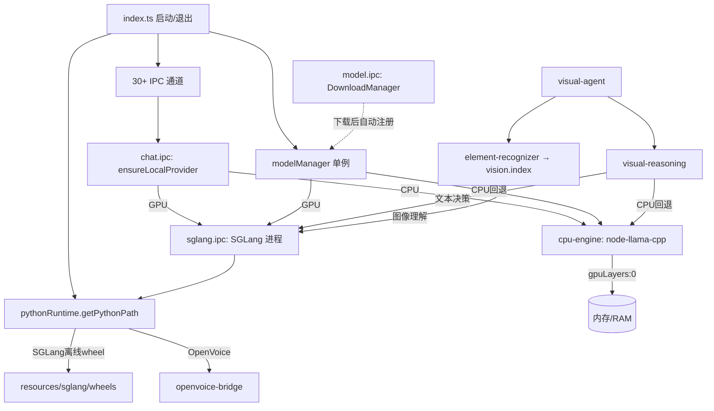
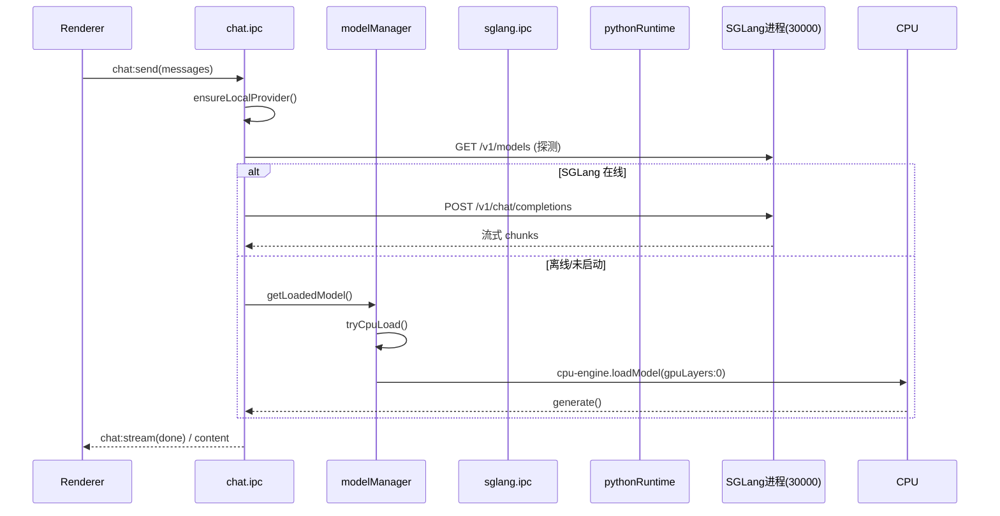

# 玄枢AI（v10.1.1）架构与运行逻辑分析 + 模型选型评估报告

> 审计人：架构师「高见远」　范围：`E:\开发` 玄枢AI 桌面项目（Electron 32 + React 18 + TS + Zustand + Tailwind v4 + node-llama-cpp + SGLang + better-sqlite3 + electron-store）
> 方法：全部结论基于源码实际读取 + 资源目录核查，附精确文件路径:行号。

---

## 一、整体运行逻辑概述

### 1.1 主进程启动流程（src/main/index.ts）
1. **入口防御**：清除 `ELECTRON_RUN_AS_NODE`，避免子进程以 Node 模式运行（index.ts:1-3）。
2. **app.whenReady**（index.ts:173）：依次注册全部 IPC 通道（Step 1，:182-235，约 30+ 个 `setupXxxHandlers`），创建窗口（:238），再逐个 `try/catch` 初始化业务模块（Step 3，:242-253）。
3. **模型注册**：硬编码 3 个模型 + 懒扫描（index.ts:256-284）。后台异步：Python 心跳、SGLang 离线安装检测、权限弹窗（:288-318）；3 秒后自动加载默认模型（:321-357）。
4. **优雅退出**：`before-quit` 用 8 秒总超时清理所有模块并停 SGLang（index.ts:378-418）；`uncaughtException`/`unhandledRejection` 弹窗后退出（:427-450）。

### 1.2 推理请求流转（以对话为例）
```
Renderer(chat:send) → chat.ipc.ensureLocalProvider()
   ├─ 探测 http://127.0.0.1:30000/v1/models 通？ → SGLangProvider → SGLang(/v1/chat/completions)
   └─ 否则 modelManager.getLoadedModel() 有？ → LocalCPUProvider → cpuInferenceEngine.generate()
外部 provider(OpenAI/Anthropic/Ollama)：从 electron-store 的 providers/activeProvider 取出（llm.ipc 仅 CRUD，无默认注册）
```
- **GPU 路径**：`modelManager.loadModel()` → `isGpuAvailable()`（nvidia-smi/rocm/WMI，阈值 4GB）→ `pythonRuntime.ensureSGLang()` → `startSGLangServer(model.path)` → `python -m sglang.launch_server --model-path ... --port 30000 --host 127.0.0.1 --mem-fraction-static 0.88`（sglang.ipc.ts:126-137）。
- **CPU 路径**：`tryCpuLoad()` → `cpuInferenceEngine.loadModel({gpuLayers:0})`（cpu-engine.ts:131-134，纯 CPU，无 GPU offload）。

### 1.3 模型加载 / 卸载 / 空闲回收（model-manager/index.ts）
- 单例 `ModelManager`；`initialize()` 扫描 `resources/models` 并启动 60s 轮询清理（:92-129）。
- 空闲回收：`IDLE_TIMEOUT_MS = 15min`（:70），`resetIdleTimer`/`cleanupUnusedModels` 在推理中（`isGenerating`）跳过卸载（:132-166）。
- 卸载：`unloadModel()` 仅调用 `stopSGLang()`（:309-313），**不调用 `cpuInferenceEngine.unload()`**。

### 1.4 核心子系统依赖（架构图）



### 1.5 关键推理时序（对话首条消息）



---

## 二、模型选型专项评估（重点）

### 2.1 实际支持哪些 Provider / 模型（证据）
- **Provider 工厂** `provider-registry.ts:26-69`：支持 `sglang / openai / ollama / anthropic / localcpu` 五类，代码均为**完整实现**（generate/generateStream/listModels），非桩。但 `LLMProviderRegistry` 启动为空，外部 provider 需用户在 `llm.ipc` 手动 add（`llm.ipc.ts` 仅有 CRUD，无默认注册）。→ **外部 provider 真实可用，但非"开箱即用"，需手动配置。**
- **预置/扫描模型**：`index.ts:263-267` 硬编码 3 个（deepseek-r1-7b / qwen2-vl-7b / nomic-embed）；`model-manager/index.ts:906-928` `scanResourceModels()` 还会把 `resources/models` 下**所有 `.gguf`** 自动注册（含 mmproj 文件！）。
- **下载目录清单** `model.ipc.ts:545-642` `DEFAULT_MODELS`：qwen2.5-7b / deepseek-r1-7b / qwen2-vl-7b / qwen2-vl-3b / minicpm-2b / nomic-embed。
- **Python 侧目录** `resources/engine/model_manager.py:38-66`：另列 qwen25-vl-7b(Q4_K_S) / qwen25-32b(Q4_K_M, 19GB)。

### 2.2 实际打包的模型文件（Glob/Bash 核查 `resources/models/`）
| 文件 | 大小 | 与注册/下载清单匹配情况 |
|---|---|---|
| deepseek-r1-7b.gguf | 4.68GB | ✅ 匹配 index.ts 与 DEFAULT_MODELS（id 一致） |
| qwen2-vl-7b.gguf | 4.68GB | ✅ id 匹配；但下载 URL 为 Q3_K_M，实际文件更大（≈Q5）→ 量化与清单不一致 |
| nomic-embed.gguf | 146MB | ✅ 匹配（RAG embedding） |
| Qwen2.5-7B-Instruct.gguf | 5.43GB | ⚠️ **孤儿**：被 scanResourceModels 注册为 id `Qwen2.5-7B-Instruct`，但不在下载清单 id（`qwen2.5-7b`），自动加载优先级 `qwen2.5-7b` 也匹配不到 |
| mmproj-F16.gguf | 1.35GB | ⚠️ 被注册为**假模型** `mmproj-F16`（type main） |
| mmproj-Qwen2.5-VL-7B-Instruct-F16.gguf | 1.35GB | ⚠️ 被注册为**假模型** `mmproj-Qwen2.5-VL-7B-Instruct-F16`（type vision，因含 'vl'） |

**其他 extraResources 核查**：
- `resources/sglang/`：存在 `install_sglang_offline.py` + `wheels/`（含 sglang-0.5.2、transformers、numpy、safetensors 等），**但缺 `torch`/`sgl-kernel`/`flashinfer`**。sglang-0.5.2 METADATA 要求 `torch==2.8.0`（extra srt）。→ 离线 `--no-index` 安装**必然失败**（见 2.5）。
- `resources/voice-models/`：仅 `.gitkeep` + 空 `base_speakers/` + 空 `checkpoints/checkpoints_v2/`，**无任何 .pth / .npy / download_models.py**。
- `resources/python/`：嵌入式 Python 3.12（含 numpy/scipy/selenium 等自动化依赖），未见 torch/openvoice 预装。

### 2.3 逐项评估

| # | 选型项 | 是否合理 | 风险 | 证据 |
|---|---|---|---|---|
| A | 主模型 deepseek-r1-7b（7B，本地 GGUF） | 基本合理 | 量化等级与清单不符（文件≈Q5，下载URL写Q5_K_M 但无后缀）；CPU 路径 chat 模板未用原生模板（cpu-engine.ts:294-316 自建 `[系统设定]/用户:/AI:` 格式，DeepSeek-R1 推理格式可能失真） | index.ts:264；cpu-engine.ts:294-316 |
| B | 视觉模型 qwen2-vl-7b（7B） | **有缺陷** | ① 缺少**匹配 mmproj**：SGLang 启动命令无 `--mmap-projector`（sglang.ipc.ts:126-137，**全仓无 mmproj 引用**）；捆绑的 mmproj 名为 Qwen2.5-VL，与 Qwen2-VL 模型不一致 → 多模态投影器大概率加载失败；② 量化高于下载清单(Q3_K_M) | sglang.ipc.ts:126-137；grep mmproj 全仓无命中 |
| C | embedding nomic-embed（RAG） | 合理 | 文件存在，id 匹配 | index.ts:266 |
| D | SGLang GPU 预集成 | **不合理/未完成** | 离线 wheels 缺 torch（2.8.0），`pip install --no-index sglang` 无法解析依赖 → 离线 GPU 推理不可用；联网时 `ensureSGLang()` 需下载 ~3GB（清华镜像），属"首跑下载"非"开箱即用" | sglang/wheels 清单；sglang-0.5.2 METADATA；python.ts:491-540 |
| E | CPU/GPU 双路径 | 设计合理，实现有漏 | 仅"GPU可用→SGLang / 否则纯CPU"两态；cpu-engine 永远 `gpuLayers:0`，即便有 GPU 也不 offload；切换/卸载时 **CPU 引擎模型未释放**（见三-P1） | cpu-engine.ts:131-134；model-manager:309-313 |
| F | visual-agent "完整版" | **名不副实** | 无独立视觉操控模型；实为"截图→element-recognizer(借视觉模型)→主模型文本决策"编排层（visual-agent/index.ts:1-14）。视觉模型(qwen2-vl)与推理主模型需**同时在线**，但架构限"单模型/6GB"，未自动 swap，质量依赖当前加载模型 | visual-agent/index.ts:1-14；element-recognizer.ts:99 |
| G | OpenVoice 语音克隆（256维 speaker embedding） | **未实现(开箱即用)** | 256 维向量虽产出，但 `checkModelsRaw` 检测不到 checkpoint/openvoice 包（voice-models 为空）→ `modelReady=false` → 永远走 MFCC/**随机**伪 embedding（openvoice-bridge.ts:260-267,442）；预置音色 .npy 不存在却 `|| true` 全量返回（:491）→ 克隆/预设音色不可用 | openvoice-bridge.ts:149-178,260-267,442,491 |
| H | TTS Edge/Piper | 待核（非主线） | edge.ts/piper.ts 存在；Edge 为云端、Piper 需本地模型，未核查是否打包 | tts/edge.ts, tts/piper.ts |

### 2.4 "声明了但未真正实现"的 Provider / 模型
- **Provider**：无。五类 provider 均完整实现；但默认不注册，需手动 add（属"未开箱"非"未实现"）。
- **模型 id 死引用**：`index.ts:341` auto-load 优先级 `['deepseek-r1-7b','qwen2.5-7b','minicpm-2b']` 中 `qwen2.5-7b`、`minicpm-2b` 从不注册 → 实际永远回退到 `installedModels[0]`（deepseek-r1-7b）。`swapToMain()`（model-manager:867,881）硬编码 `deepseek-r1-7b`，若默认主模型是 Qwen2.5 则切换逻辑错误。
- **假模型**：mmproj 两个文件被注册为可加载 LLM（model-manager:915-925，因按文件名含 'vl' 判 type）。

### 2.5 SGLang 预集成方案是否成立
**不成立（离线场景）**。理由：离线安装脚本 `install_sglang_offline.py` 用 `pip install --no-index --find-links wheels sglang`，而 wheels 目录**缺少 torch 2.8.0、sgl-kernel、flashinfer**（仅 sglang+transformers+基础依赖）。sglang 0.5.2 的 METADATA 显式依赖 `torch==2.8.0; extra==srt`。因此离线必然失败。联网场景依赖 `ensureSGLang()` 现拉 ~3GB，违背"开箱即用"承诺。建议：要么将 torch 等 wheel 一并打包，要么明确产品定位为"首跑联网下载推理引擎"。

---

## 三、架构现存问题清单

| 严重度 | 问题 | 影响 | 证据路径 |
|---|---|---|---|
| **P0** | SGLang 离线 wheel 缺 torch，GPU 推理离线不可用 | 目标"开箱即用 GPU 推理"在离线机失效，只能降级纯 CPU | resources/sglang/wheels（无 torch）；sglang-0.5.2 METADATA；python.ts:560-603 |
| **P1** | CPU 引擎模型永不释放（资源泄漏） | model-manager.unloadModel 只 stopSGLang，不调 cpuInferenceEngine.unload；loadModel 重复 load 不 dispose 旧模型；before-quit 清理列表无 cpuInferenceEngine.unload → 4-9GB 常驻内存直至进程被杀 | model-manager:309-313, 297-337；cpu-engine:341-350；index.ts:385-398 |
| **P1** | mmproj 投影器未接入 + 文件名不匹配 | qwen2-vl 视觉多模态大概率失败；且 mmproj 文件被注册成假 LLM 模型出现在模型列表 | sglang.ipc.ts:126-137（无 mmproj 参数）；model-manager:915-925；resources/models 含 mmproj-* |
| **P1** | OpenVoice 语音克隆/预设音色开箱不可用 | 256 维 embedding 实为 MFCC/随机伪向量；5 个预置音色 .npy 缺失却 `|| true` 返回 | openvoice-bridge.ts:149-178,260-267,442,491；resources/voice-models 为空 |
| **P2** | 模型目录三处不一致 | index.ts 硬编码、model.ipc DEFAULT_MODELS、engine/model_manager.py 三套模型名/量化/甚至含 32B(19GB, 超 6GB 显存目标) 互相对不上 | index.ts:263-267；model.ipc.ts:545-642；engine/model_manager.py:38-66 |
| **P2** | mem-fraction 不一致/过激 | sglang.ipc.ts:26 默认 0.88，注释却写 0.80(RTX3060 6GB)；0.88×6GB=5.28GB 池，权重 4.68GB 后 KV cache 余量不足→易 OOM | sglang.ipc.ts:26,125；index.ts:325 |
| **P2** | visual-agent 多模型并发约束未解决 | 视觉识别(qwen2-vl)与推理(主模型)需同时在线，但架构限单模型；无自动 swap 到视觉模型逻辑 | visual-agent/index.ts:1-14；element-recognizer.ts:99；vision/index.ts:79 |
| **P3** | localhost vs 127.0.0.1 不一致 | vision/index.ts:79 用 `localhost:30000`，SGLang 绑 127.0.0.1；localhost 解析到 ::1 时视觉调用失败 | vision/index.ts:79；sglang.ipc.ts:18,130 |
| **P3** | 双配置源 | 业务配置走 electron-store（ipc/config.ipc.ts:1,67），但 index.ts:333-339 用裸 `config.json` 读 defaultModelId → 两处 truth 不一致 | ipc/config.ipc.ts:1,67,169；index.ts:333-339 |
| **P3** | CPU 路径 chat 模板未用原生模板 | DeepSeek-R1/Qwen 的 chat template 被绕开，输出格式/推理质量可能退化 | cpu-engine.ts:294-316；provider.ts:333-345 |
| **P3** | 缩写串匹配歧义 | swapToVision 用 `m.id.includes('vl')` 找视觉模型，mmproj-Qwen2.5-VL-... 也含 'vl' → 可能误选假模型 | model-manager:828-835 |
| **P3** | IPC 通道命名/规模 | ipc/ 下共 **98** 个 `ipcMain.handle` 通道，无统一通道常量表，易出现拼写/前后端不一致 | grep `ipcMain.handle('` → 98 处 |
| **P3（UI）** | 设计令牌未统一 | 与 QA（严过关）一致：globals.css:14 `--bg-base:#08080a`、:32 `--brand:#6366f1`，与文档蓝金(#2563EB/#F59E0B)不符；缺 `--accent/--accent2`；各页重复 `COLORS.accent` 常量(9处)；VoiceChat 自起 `C` 对象(#3b82f6)绕过令牌；#2563EB 游离硬编码(main.tsx:16, ErrorBoundary.tsx:104/111, Model:538-539)。结论方向：应在 globals.css 收敛为单一令牌源 | globals.css:14,32；各页 COLORS（见 QA 报告）；Sidebar.tsx:144-152 |

---

## 四、开箱即用（模型与依赖）达成度结论

| 维度 | 达成度 | 说明 |
|---|---|---|
| 主对话模型(DeepSeek-R1 7B) 预置 | ✅ 达成 | deepseek-r1-7b.gguf 存在，自动加载可用（CPU 质量见 P3） |
| RAG embedding 模型 | ✅ 达成 | nomic-embed.gguf 存在 |
| 视觉操控模型 | ⚠️ 部分 | qwen2-vl-7b.gguf 存在，但 **mmproj 不匹配/未接入**，多模态大概率失效（P1） |
| GPU 推理引擎(SGLang) 离线 | ❌ 未达成 | wheels 缺 torch，离线装不上（P0）；联网需首跑下载 3GB |
| 语音克隆(OpenVoice 256维) | ❌ 未达成 | 模型/包均未打包，256 维为伪向量（P1） |
| TTS(Edge/Piper) | ⚠️ 待核 | edge 云端可用；Piper 本地模型未核查 |
| 外部 Provider(Ollama/OpenAI) | ⚠️ 需手动 | 代码完整但无默认注册，需用户配置 |
| 整体结论 | **未完全达成"开箱即用"** | 离线环境下仅"主模型 CPU 推理 + RAG"可用；GPU 推理引擎与语音克隆两大卖点缺失/失效。建议优先补齐：① SGLang wheels 加入 torch/sgl-kernel（或改为联网首跑并明示）；② 修正 mmproj 文件名并显式传 `--mmap-projector`；③ 打包 OpenVoice checkpoint 与预置音色 .npy，或移除"256维 OpenVoice"营销措辞；④ 清理 mmproj 假模型注册与死引用 id。 |

---
*附：本次审计同时采纳 QA（严过关）关于 UI 设计令牌不一致的发现，已在三-P3(UI) 与架构一致性结论中引用。*
